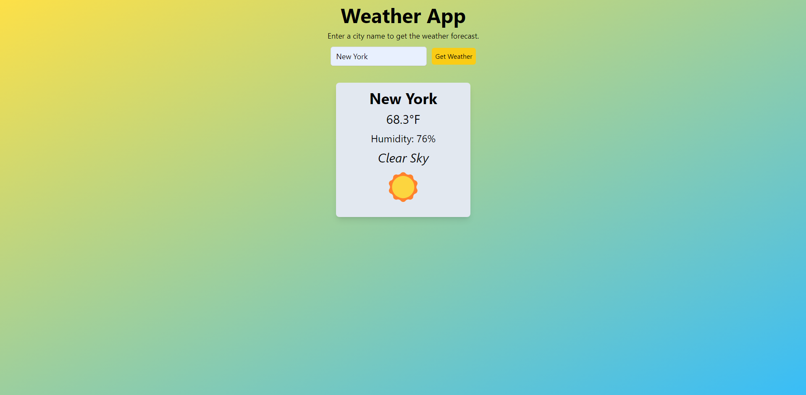

# Weather App

This repository contains the source code for a weather app project that uses the free API from <a href="https://openweathermap.org/" target="_blank">OpenWeather</a>. If you want to view current weather data, just click the link, create an account, generate a new API key, and copy and paste it in the "apiKey" variable located in `main.js`. Users can type a city name into the search bar and press the "Get Weather" button to see the current weather conditions for that city, including the temperature (in Fahrenheit), humidity, description of weather, and weather condition. The project was written using HTML, TailwindCSS, and JavaScript.